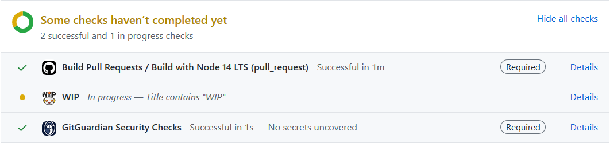

# Check PR Title contains WIP

This actions check just one thing, `Does the pull request title include WIP?`

It makes actions fail when PR title contains `WIP:`.

| Before             | After |
| ------------------ | ----- |
|  |  |

## Usages

After checkout steps

```yaml
steps:
  - name: Check Title
    uses: windsekirun/check-title-wip-actions
```
